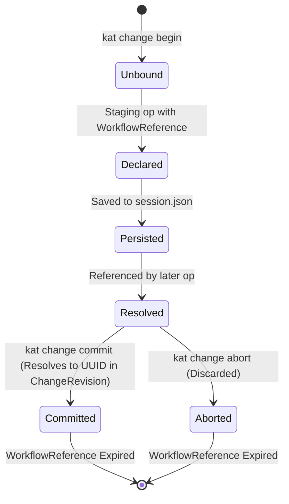
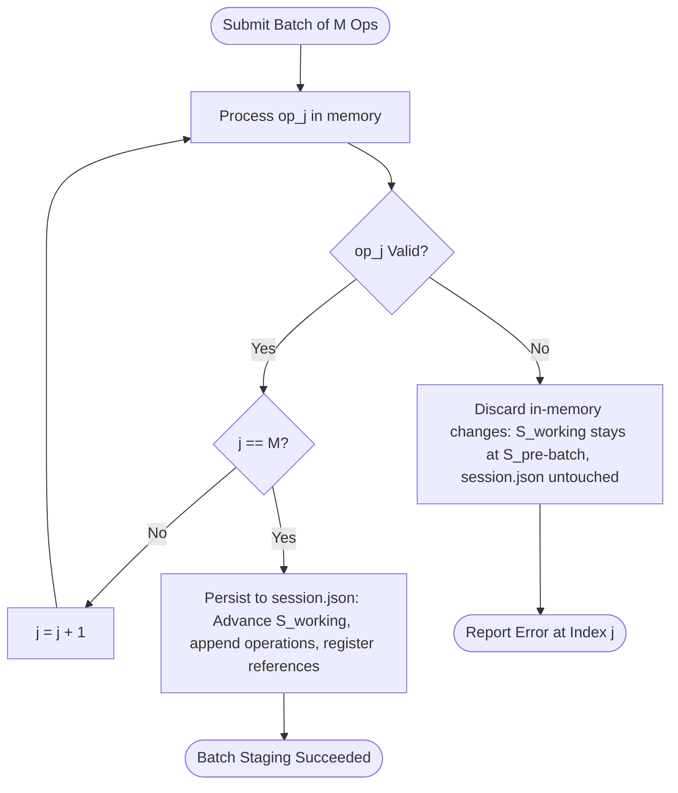

# KAT v0.4 Authoring Model

## Status

Draft.

This document defines the authoring model for KAT v0.4.

It is derived from:

- the v0.4 findings and problems ([`findings.md`](file:///home/joshua/Projects/kat/docs/implementation/v0.4/findings.md));
- the v0.4 requirements ([`requirements.md`](file:///home/joshua/Projects/kat/docs/implementation/v0.4/requirements.md));
- the v0.4 use cases ([`use-cases.md`](file:///home/joshua/Projects/kat/docs/implementation/v0.4/use-cases.md));
- the v0.4 operations model ([`operations.md`](file:///home/joshua/Projects/kat/docs/implementation/v0.4/operations.md));
- the v0.4 reference model ([`reference-model.md`](file:///home/joshua/Projects/kat/docs/implementation/v0.4/reference-model.md)).

This document defines how KAT constructs an ordered semantic Change efficiently using the existing mutation model and the new reference model.

It does not define:

- final CLI syntax or flag spellings;
- concrete command names;
- final batch submission file formats;
- context query semantics;
- graph quality diagnostic algorithms.

Those belong to later design stages (`context-model.md`, `graph-quality-model.md`, `machine-interface.md`, `cli.md`).

---

# 1. Central Design Question

The authoring model answers one central question:

> **How does KAT efficiently construct an ordered semantic Change using the existing mutation model and the new reference model?**

In v0.1 through v0.3.1, mutating KAT required either single-operation auto-commits or multi-operation Change staging where every step required capturing, storing, and passing 36-character UUIDs or hex prefixes.

The Statit experiment demonstrated that authoring 70 elements and 110 relationships required 213 CLI mutations and forced the creation of an external Python script.

The v0.4 authoring model eliminates this friction while preserving KAT's core architecture:

```text
canonical identity
    unchanged (UUIDv4)

mutation model
    unchanged (7 canonical operations)

accepted-state semantics
    unchanged (point-in-time point reads)

draft-local interaction metadata
    permitted in private draft session
```

---

# 2. Design Invariants

The authoring model enforces the following core invariants.

## INV-AUTH-01: Canonical Mutation Preservation

Batch authoring or high-level submission mechanisms shall not introduce a new canonical object type or bypass the 7 canonical mutation operations:

```text
CreateElement
UpdateElement
DeprecateElement
SupersedeElement
Link
Unlink
AccountArtifact
```

Batch authoring is an interaction mechanism; it produces an ordered sequence of canonical mutation operations committed inside a single `ChangeRevision`.

---

## INV-AUTH-02: Sequential Working State Transitions

Operations staged within a Change transition candidate state sequentially:

$$S_0 \xrightarrow{\text{op}_1} S_1 \xrightarrow{\text{op}_2} S_2 \dots \xrightarrow{\text{op}_N} S_{\text{working}}$$

Each operation $\text{op}_k$ observes candidate working state $S_{k-1}$ produced by all preceding operations in the Change.

---

## INV-AUTH-03: Ordered Workflow Reference Availability

A workflow reference declared by operation $\text{op}_k$ becomes resolvable and usable only after operation $\text{op}_k$ succeeds in staging.

Forward references (referencing a handle before its declaring operation has executed) are invalid.

---

## INV-AUTH-04: Draft Session Persistence Boundary

Workflow references and draft interaction metadata are stored exclusively inside local private draft session storage (`.kat/work/change/session.json`).

They shall not be written to canonical object storage (`.kat/objects/`) or accepted state (`refs/accepted`).

---

## INV-AUTH-05: Absolute Commit Expiration

Upon Change commit, all workflow references resolve away into stable canonical UUIDs inside the published `ChangeRevision`.

Upon Change commit or abort, all workflow reference bindings are discarded. No workflow reference survives into accepted repository state.

---

# 3. Draft Session Architecture & State Model

KAT maintains open multi-operation Change transactions using local draft session storage at `.kat/work/change/session.json`.

In v0.4, the conceptual draft session structure is extended to include draft-local workflow reference bindings:

```text
DraftSession {
    schema_version: u32,
    status: DraftSessionState,
    base_state_id: ObjectId,
    base_change_id: Option<ObjectId>,
    created_at: String,
    description: Option<String>,
    operations: Vec<Operation>,
    staged_element_versions: Vec<KnowledgeElementVersion>,
    staged_relationship_versions: Vec<RelationshipVersion>,
    working_state: SemanticState,
    workflow_references: HashMap<WorkflowReference, TargetIdentity>
}
```

where `TargetIdentity` represents a canonical stable `ElementId` or `RelationshipId`.

## Non-Canonical Storage Boundary

`.kat/work/change/session.json` is strictly private, local, and non-canonical. 

Extending `DraftSession` to include `workflow_references` requires:

- **0 changes** to canonical object storage (`.kat/objects/`);
- **0 changes** to `refs/accepted`;
- **0 changes** to `spec/canonical-format.cddl`;
- **0 changes** to CBOR byte encoding.

---

# 4. Workflow Reference Lifecycle

The lifecycle of a workflow reference spans five distinct phases:

```text
1. Declaration
     ↓
2. Draft-Session Persistence
     ↓
3. Sequential Resolution
     ↓
4. Change Commit / Abort
     ↓
5. Expiration
```



## Phase 1: Declaration

A workflow reference is declared when an authoring operation introduces a new Knowledge Element or Relationship (or binds an existing accepted object) and attaches a local handle name.

Conceptually:

$$\text{CreateElement}(\text{type}, \text{properties}) \longrightarrow (\text{new } \text{ElementId } E_k, \text{declare } \text{WorkflowReference } R)$$

## Phase 2: Draft-Session Persistence

Upon successful execution of the operation against candidate state $S_{k-1} \to S_k$:

1. Operation $\text{op}_k$ is appended to `session.operations`.
2. Any new element or relationship versions are appended to `session.staged_element_versions` or `session.staged_relationship_versions`.
3. `session.working_state` is updated to $S_k$.
4. The mapping $R \mapsto E_k$ is inserted into `session.workflow_references`.
5. `session.json` is written atomically to disk.

Because `session.json` persists between process runs, workflow reference $R$ survives separate CLI invocations during the same open draft.

## Phase 3: Sequential Resolution

When a subsequent operation $\text{op}_m$ ($m > k$) references $R$:

1. KAT checks `session.workflow_references` for key $R$.
2. If present, $R$ resolves to stable identity $E_k$.
3. Operation $\text{op}_m$ executes against candidate state $S_{m-1}$ using $E_k$.

## Phase 4: Change Commit / Abort

- **On Commit**: KAT inspects all staged operations in `session.operations`. All reference arguments have already been resolved to stable canonical UUIDs in `session.operations`. KAT encodes the canonical `ChangeRevision`, writes objects to `.kat/objects/`, updates `refs/accepted`, and deletes `.kat/work/change/session.json`.
- **On Abort**: KAT deletes `.kat/work/change/session.json`. All staged operations, working state, and workflow references are discarded.

## Phase 5: Expiration

Once `session.json` is deleted, workflow reference $R$ ceases to exist. Any subsequent query or command referencing $R$ will fail with `UnknownReference`.

---

# 5. Binding Existing Objects (`bind_reference`)

In addition to assigning workflow references to newly created elements, large Changes often repeatedly reference already accepted Knowledge Elements (e.g. linking 5 new implementations to an existing requirement).

The authoring model supports binding an existing accepted element to a draft-local workflow reference.

## Semantics

Binding an existing object:

1. Resolves an actor reference (UUID or unique prefix) against accepted state $S_0$.
2. Verifies that the object exists in $S_0$.
3. Adds the mapping $R \mapsto \text{ElementId}$ to `session.workflow_references`.
4. Does **NOT** create a mutation operation in `session.operations` (binding an existing object is purely interaction metadata, not a semantic mutation).

## Example Conceptual Flow

```text
bind accepted requirement "9f1c65c5" as @req-auth

create Implementation "OAuth2 Token Validator" as @impl-oauth

link @impl-oauth realizes @req-auth
```

Here `@req-auth` allows the actor to refer to the existing requirement `9f1c65c5` throughout the rest of the draft transaction without typing its UUID prefix repeatedly.

---

# 6. Sequential Operation Execution & Candidate State Transitions

The authoring model maintains strict mathematical sequentiality during Change staging.

Let $S_0$ be the accepted state at `kat change begin`.

When a sequence of $N$ operations $(\text{op}_1, \text{op}_2, \dots, \text{op}_N)$ is staged:

$$\begin{aligned}
S_1 &= \text{apply}(\text{op}_1, S_0) \\
S_2 &= \text{apply}(\text{op}_2, S_1) \\
&\;\;\vdots \\
S_k &= \text{apply}(\text{op}_k, S_{k-1}) \\
&\;\;\vdots \\
S_{\text{working}} &= S_N
\end{aligned}$$

## Operational Preconditions at Step $k$

For operation $\text{op}_k$:

1. **Reference Resolution**: All input arguments (source IDs, target IDs, expected versions) are resolved against:
   - `session.workflow_references` (draft handles);
   - candidate state $S_{k-1}$ (newly created or updated element/relationship versions);
   - accepted base state $S_0$.
2. **Precondition Validation**:
   - If $\text{op}_k$ is `UpdateElement`, `expected_version` must match the active version of the element in $S_{k-1}$.
   - If $\text{op}_k$ is `Link`, `source_element_id` and `target_element_id` must exist in $S_{k-1}$, and their current element types must satisfy ontology constraints defined in active `OntologyVersion`.
   - If $\text{op}_k$ is `AccountArtifact`, `artifact_id` must exist in $S_{k-1}$, be an active `kat.core/artifact`, and all direct accountability edges must be accounted for against $S_{k-1}$.
3. **Candidate Validation**: Candidate state $S_k$ must contain no mechanical violations (missing endpoints, invalid types, duplicate triples).

---

# 7. Multi-Operation Submission Semantics

KAT v0.4 supports two modes of staging operations into an open Change transaction:

1. **Single-Operation Incremental Staging**: Executing individual mutation commands against an open draft.
2. **Multi-Operation Batch Submission**: Submitting an ordered sequence of operations $(\text{op}_1, \dots, \text{op}_M)$ in a single submission.

## Core Invariant

$$\text{Multi-Operation Batch Submission} \neq \text{Batch Semantic Operation}$$

There is no "batch" canonical object or "batch" mutation in KAT. 

A multi-operation batch submission is processed by KAT as an ordered loop of individual canonical mutation operations applied to `session.working_state`:

```text
for op in batch_submission:
    resolve_references(op, session)
    validate_preconditions(op, session.working_state)
    session.working_state = apply(op, session.working_state)
    session.operations.push(op)
    session.workflow_references.update(op.declared_references)
save_session(session)
```

The output of a batch submission is identical in structure to invoking incremental staging $M$ times.

---

# 8. Failure & Transactional Recovery Semantics

When an error occurs during operation staging, KAT enforces clear transactional boundaries to prevent partial or corrupt draft states.

## Case A: Single-Operation Staging Failure

If a single incremental staging operation fails (e.g. ontology type rejection during `link`):

1. Operation $\text{op}_k$ is **NOT** appended to `session.operations`.
2. `session.working_state` remains at $S_{k-1}$.
3. Any workflow references declared solely by $\text{op}_k$ are **NOT** added to `session.workflow_references`.
4. KAT returns an explicit error explaining the failure.
5. **Session Status**: Session remains `Open` at state $S_{k-1}$. The user or agent may correct the command and continue.

## Case B: Multi-Operation Batch Submission Failure

When a batch of $M$ operations $(\text{op}_1, \dots, \text{op}_M)$ is submitted, and operation $\text{op}_j$ ($1 \le j \le M$) fails:

### Transactional Boundary Rule: Atomic Batch Submission Rollback

A multi-operation batch submission is **atomically staged or atomically rejected**:

- If all $M$ operations succeed, `session.working_state` advances from $S_{\text{pre-batch}}$ to $S_{\text{post-batch}}$, all $M$ operations are appended, all declared workflow references are registered, and `session.json` is updated once.
- If operation $\text{op}_j$ fails ($1 \le j \le M$):
  1. Operations $\text{op}_1 \dots \text{op}_{j-1}$ executed in memory are **rolled back**.
  2. `session.working_state` remains at $S_{\text{pre-batch}}$.
  3. `session.operations` remains unmodified.
  4. `session.workflow_references` remains unmodified.
  5. `session.json` on disk is **NOT** updated.
  6. KAT reports an explicit batch error detailing:
     - failing operation index $j$;
     - failing operation payload;
     - precise semantic failure reason (e.g., `RelationshipTargetTypeNotAllowed`).



### Rationale for Atomic Batch Rollback

Atomic batch rollback prevents "half-staged" batch transactions where an agent or script must guess which subset of a JSON batch file succeeded. Either the entire batch payload is valid and staged, or the draft session remains cleanly at its prior valid state.

---

# 9. Draft Inspection (`kat change status`)

To prevent workflow references and candidate state from becoming an opaque black box, `kat change status` provides detailed inspection of the open draft transaction.

## Information Provided by `change status`

1. **Session Metadata**:
   - Session status (`Open` or `Stale`).
   - Base accepted state ObjectId ($S_0$).
   - Base accepted ChangeRevision ObjectId.
   - Creation timestamp & change description.
2. **Staged Operations Log**:
   - Ordered list of all staged canonical operations ($\text{op}_1 \dots \text{op}_N$).
3. **Workflow Reference Map**:
   - Active workflow references and their resolved canonical `ElementId` / `RelationshipId` bindings.
4. **Candidate Delta**:
   - Count of newly created elements, updated elements, deprecated elements, superseded elements, links created, links unlinked, and artifacts accounted.
5. **Candidate Accountability Preview**:
   - Preview of artifact accountability metrics (`total`, `stale`, `reconciled_in_draft`) evaluated against candidate working state $S_{\text{working}}$.
6. **Candidate Validation Preview**:
   - Mechanical validation report executed against candidate working state $S_{\text{working}}$.

---

# 10. Commit & Abort Lifecycle

## 10.1 Change Commit (`kat change commit`)

When `kat change commit` is executed:

1. **Stale Check**: KAT verifies that `refs/accepted` still equals `session.base_state_id`. If `refs/accepted` has moved (concurrent writer published a change), commit is rejected with `StaleSession`.
2. **Empty Check**: If `session.operations` is empty, commit is rejected as a no-op.
3. **Final Invariant & Candidate Validation**: KAT validates that candidate state $S_{\text{working}}$ satisfies all mechanical invariants and ontology rules.
4. **Canonical Object Encoding**:
   - KAT constructs a canonical `ChangeRevision` object containing:
     - `parents`: `[session.base_change_id]` (or empty if first change);
     - `base_states`: `[session.base_state_id]`;
     - `result_state`: `session.working_state` ObjectId;
     - `timestamp`: ISO-8601 string;
     - `description`: optional Change description;
     - `operations`: `session.operations` (containing canonical stable UUIDs only).
   - Writes `KnowledgeElementVersion` objects to `.kat/objects/`.
   - Writes `RelationshipVersion` objects to `.kat/objects/`.
   - Writes `SemanticState` object to `.kat/objects/`.
   - Writes `ChangeRevision` object to `.kat/objects/`.
5. **Atomic Ref Update**: KAT updates `refs/accepted` from `session.base_state_id` to the new `SemanticState` ObjectId.
6. **Session Cleanup**: KAT removes `.kat/work/change/session.json`.
7. **Regression Invariant**: For a valid, non-stale draft committing cleanly without intervening accepted-state changes:

$$\text{accountability preview}(S_{\text{working}}) = \text{accountability post-commit}(S_{\text{accepted}})$$

## 10.2 Change Abort (`kat change abort`)

When `kat change abort` is executed:

1. KAT removes `.kat/work/change/session.json`.
2. Staged operations, working state $S_{\text{working}}$, and workflow references are discarded immediately.
3. `refs/accepted` and `.kat/objects/` remain untouched.

---

# 11. Interaction with Existing Objects

The authoring model permits binding existing accepted elements to draft-local workflow references.

## Mechanics

1. Actor supplies an existing element reference (UUID or unique prefix).
2. KAT resolves the reference against accepted base state $S_0$.
3. If resolved uniquely to `ElementId` $E_{\text{exist}}$, KAT adds the mapping $R \mapsto E_{\text{exist}}$ to `session.workflow_references`.
4. The binding exists only within the draft session and is discarded upon commit or abort.

## Usage in Operations

```text
bind 9f1c65c5 as @req-auth

create Implementation "OAuth Token Service" as @impl-oauth

link @impl-oauth realizes @req-auth
```

When `link` is evaluated:
- `@impl-oauth` resolves to newly created element ID $E_{\text{new}}$.
- `@req-auth` resolves to existing element ID $E_{\text{exist}}$.
- `Link` operation is staged as `Link(new_relationship_version_id)` connecting $E_{\text{new}} \to E_{\text{exist}}$.

---

# 12. Boundary Clarifications for Downstream Specs

To maintain clean modularity across the specification suite, `authoring-model.md` explicitly delegates concrete syntax choices to downstream documents:

1. **CLI Syntax (`cli.md`)**:
   - Does **NOT** lock CLI flag names (e.g., whether workflow handles are declared via `--as <name>`, `@name`, `$name`, or `ref:<name>`).
   - Illustrative syntax in this document (e.g. `@name`) is conceptual only.
2. **Batch Submission File Schema (`machine-interface.md`)**:
   - Does **NOT** lock the JSON / YAML schema for multi-operation batch files.
   - Defines the batch processing semantics (atomic rollback, sequential staging, reference resolution), but leaves payload schema to `machine-interface.md`.
3. **Context & Quality Operations (`context-model.md`, `graph-quality-model.md`)**:
   - Authoring model governs semantic mutations and draft transactions. Query projections belong to context and quality specification documents.

---

# 13. Summary Matrix of Authoring Operations & Lifecycle

| Workflow Stage | State Modified | Persistent File Affected | Canonical Object Created? | Reference Availability |
| :--- | :--- | :--- | :--- | :--- |
| `kat change begin` | Draft Session initialized | `.kat/work/change/session.json` | No | Empty reference table |
| `bind <existing> as <ref>` | `session.workflow_references` | `.kat/work/change/session.json` | No | `<ref>` immediately available |
| Staging `CreateElement as <ref>` | `session.working_state`, `operations` | `.kat/work/change/session.json` | No (Candidate state only) | `<ref>` available for next op |
| Staging `Link <src_ref> <tgt_ref>` | `session.working_state`, `operations` | `.kat/work/change/session.json` | No (Candidate state only) | Rel handle available if declared |
| Staging `AccountArtifact <art_ref>`| `operations` (baseline update) | `.kat/work/change/session.json` | No | Re-accounted baseline staged |
| `kat change status` | None (Read-only draft inspect) | None | No | Inspects active references |
| `kat change commit` | `refs/accepted` advanced | `.kat/objects/`, `refs/accepted` | **YES** (`ChangeRevision`, `SemanticState`, Element/Rel Versions) | All references expire; `session.json` deleted |
| `kat change abort` | Draft Session deleted | `.kat/work/change/session.json` deleted | No | All references expired; draft discarded |

---

# 14. Next Specification Stage

The next document in the specification sequence is:

```text
docs/implementation/v0.4/context-model.md
```

It shall define:
- bounded semantic neighborhood retrieval semantics (`Context`);
- root provenance preservation;
- category grouping (`requirements`, `constraints`, `decisions`, `implementations`, `artifacts`, `validations`);
- Artifact routing anchor semantics;
- deterministic context aggregation rules.
