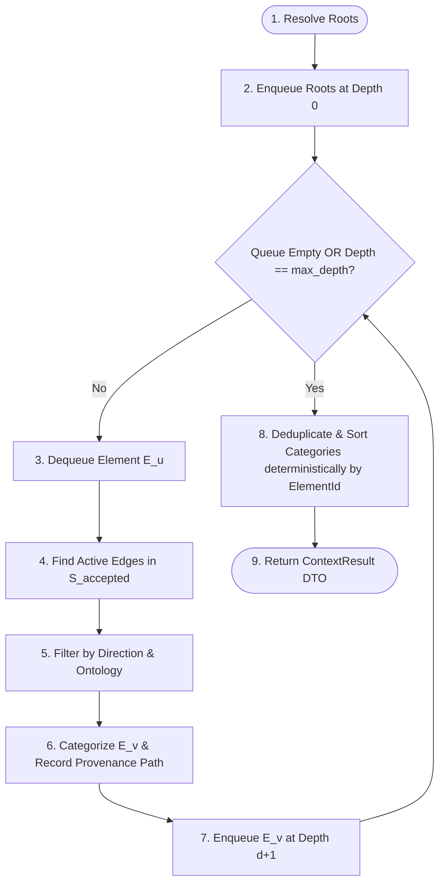

# KAT v0.4 Context Model

## Status

Draft.

This document defines the semantic projection, traversal algorithm, and result structure for the `Context` operation in KAT v0.4.

It is derived from:

- the v0.4 foundation documents ([`findings.md`](file:///home/joshua/Projects/kat/docs/implementation/v0.4/findings.md), [`requirements.md`](file:///home/joshua/Projects/kat/docs/implementation/v0.4/requirements.md), [`use-cases.md`](file:///home/joshua/Projects/kat/docs/implementation/v0.4/use-cases.md), [`operations.md`](file:///home/joshua/Projects/kat/docs/implementation/v0.4/operations.md), [`reference-model.md`](file:///home/joshua/Projects/kat/docs/implementation/v0.4/reference-model.md));
- the interaction model ([`interaction-model.md`](file:///home/joshua/Projects/kat/docs/implementation/v0.4/interaction-model.md)).

The central thesis of this document is:

> **Context is a deterministic, bounded, explainable projection of the semantic graph optimized for orientation and development routing.**

It avoids two non-functional extremes:
1. $\text{Context} \neq \text{graph dump}$ (it is not an unrestricted or exhaustive raw graph dump).
2. $\text{Context} \neq \text{AI-selected "relevant files"}$ (it performs zero probabilistic inference or LLM guessing).

---

# 1. Purpose & User Intention

`Context` is the primary retrieval porcelain capability for KAT v0.4.

It satisfies the developer intention:

> *"What is the semantic context, rationale, and physical code structure surrounding this feature or requirement?"*

In v0.1 through v0.3.1, answering this question required manually orchestrating a sequence of independent queries:

```text
kat show <id>
kat trace <id>
kat impact <id>
kat artifacts
kat validate
```

`Context` composes these underlying traversal primitives into a single deterministic semantic projection.

---

# 2. Composition Architecture

`Context` composes rationale, consequences, evidence, responsibilities, and physical anchors into a structured neighborhood around one or more root entry points:

```text
                                ROOT ENTRY POINT(S)
                                         │
       ┌─────────────────┬───────────────┼───────────────┬─────────────────┐
       ▼                 ▼               ▼               ▼                 ▼
   PROVENANCE      REQUIREMENTS     CONSTRAINTS      DECISIONS      IMPLEMENTATIONS
  (Intent / Rationale)                                                   │
       │                                                                 │
       ▼                                                                 ▼
   VALIDATIONS                                                       ARTIFACTS
   (Evidence)                                                     (Physical Anchors)
```

## Result Categories

A `ContextResult` groups retrieved objects into 8 explicit semantic roles:

1. **`roots`**: The resolved root Knowledge Element(s) supplied as input.
2. **`provenance`**: Upstream Intent or Requirement elements reachable via rationale predicates (`kat.core/motivates`, `kat.core/addresses`).
3. **`requirements`**: Functional or non-functional Requirement elements connected to the root.
4. **`constraints`**: Constraint elements restricting the root or its implementations (`kat.core/restricts`).
5. **`decisions`**: Design Decision elements guiding implementations or addressing requirements (`kat.core/guides`, `kat.core/addresses`).
6. **`implementations`**: Implementation elements realizing requirements or constrained by rules (`kat.core/realizes`).
7. **`artifacts`**: Artifact elements representing implementations or derived from decisions (`kat.core/represents`, `kat.core/derived-from`).
8. **`validations`**: Validation evidence elements targeting requirements, constraints, or implementations (`kat.core/validates`).

---

# 3. Traversal Algorithm & Bounding

`Context` executes a deterministic breadth-first graph traversal over accepted repository state $S_{\text{accepted}}$ (or candidate working state $S_{\text{working}}$ if explicitly inspecting draft status).

## 3.1 Inputs

Conceptually:

```text
ContextInputs {
    roots: Vec<ElementReference>,
    max_depth: Option<usize>,
    categories: Option<HashSet<String>>,
    direction: TraversalDirection,
}
```

- **`roots`**: One or more Element references (UUID, hex prefix, or workflow reference handle).
- **`max_depth`**: Maximum relationship hops from any root (default: `2` hops).
- **`categories`**: Optional category filter (e.g. restrict retrieval to `requirements` and `artifacts`).
- **`direction`**: Traversal direction (`Both` [default], `Upstream` [rationale], `Downstream` [consequences]).

## 3.2 Traversal Steps

1. **Root Resolution**: Resolve all supplied root references against accepted state $S_{\text{accepted}}$. If any root reference is unknown or ambiguous, return `ResolveError` immediately (all-or-nothing root resolution).
2. **Queue Initialization**: Initialize a FIFO traversal queue with `(root_id, depth = 0, path = [root_id])`.
3. **Visited Set**: Maintain a set of visited `(ElementId, Path)` pairs to prevent infinite cycles on cyclic graphs while preserving path provenance.
4. **BFS Expansion**:
   For each element $E_u$ at depth $d < \text{max\_depth}$:
   - Query active relationship versions in $S_{\text{accepted}}$ where $E_u$ is source or target.
   - Filter edges by `direction` and allowed ontology predicates.
   - For each adjacent element $E_v$:
     - Append $E_v$ to the result set.
     - Categorize $E_v$ according to its canonical `type_id` and relationship predicate.
     - Record the connecting relationship $R_{uv}$ and path provenance $(E_u \xrightarrow{R_{uv}} E_v)$.
     - If $d + 1 < \text{max\_depth}$, enqueue $E_v$ at depth $d + 1$.
5. **Multi-Root Deduplication**: If multiple roots reach the same element $E_x$, $E_x$ is included once in the result category, but all distinct provenance paths from each root to $E_x$ are preserved in its path provenance record.
6. **Deterministic Sorting**: Sort all elements within each result category deterministically by stable `ElementId`.
7. **Truncation Flag**: If any adjacent node expansion was skipped because depth reached `max_depth`, set `is_truncated = true` on the result.



---

# 4. Artifact Anchors & Physical Routing

`Context` treats `kat.core/artifact` elements as **semantic routing anchors** into the physical codebase, NOT as a full AST file dependency graph.

## Physical Anchor Mapping

When an Artifact element is included in `ContextResult`:

```text
Artifact Element
    ├── element_id: 9cec3c64-...
    ├── title: "src/store.js - persistence code"
    ├── properties:
    │     path = "src/store.js"
    └── represents:
          Implementation "JSON-file backed store" (99822b8d-...)
```

`ContextResult` extracts the relative file path property (`path`) to present clear physical entry points to developers and agents.

## Development Routing Workflow

```text
1. Execute Context Query (Root: Requirement "Session Plan Snapshotting")
     ↓
2. KAT returns ContextResult (Category implementations & artifacts)
     ↓
3. Mapped Artifact Anchors:
     - lib/features/workout/services/workout_repository.dart
     - lib/core/database/app_database.dart
     ↓
4. Developer/Agent opens physical files and follows local code structure
```

KAT provides the semantic routing to the 2 anchor files; ordinary language servers and file tools handle local code navigation.

---

# 5. Deterministic Context Schema (Abstract DTO)

The abstract `ContextResult` data transfer object is defined as:

```text
ContextResult {
    repository_id: RepositoryId,
    accepted_state_id: ObjectId,
    max_depth_applied: usize,
    is_truncated: bool,
    roots: Vec<ElementSummary>,
    provenance: Vec<ContextNode>,
    requirements: Vec<ContextNode>,
    constraints: Vec<ContextNode>,
    decisions: Vec<ContextNode>,
    implementations: Vec<ContextNode>,
    artifacts: Vec<ArtifactAnchorNode>,
    validations: Vec<ContextNode>,
}

ContextNode {
    element_id: ElementId,
    type_id: String,
    title: Option<String>,
    provenance_paths: Vec<ProvenancePath>,
}

ArtifactAnchorNode {
    element_id: ElementId,
    title: Option<String>,
    file_path: Option<String>,
    accountability_status: AccountabilityStatus, // CURRENT | STALE | UNACCOUNTED
    represented_implementation_ids: Vec<ElementId>,
    provenance_paths: Vec<ProvenancePath>,
}

ProvenancePath {
    root_element_id: ElementId,
    hops: Vec<PathHop>,
}

PathHop {
    relationship_id: RelationshipId,
    relationship_type: String,
    target_element_id: ElementId,
}
```

The concrete JSON serialization format for this DTO is defined in [`machine-interface.md`](file:///home/joshua/Projects/kat/docs/implementation/v0.4/machine-interface.md).

---

# 6. Invariants & Guarantees

## INV-CTX-01: Point-in-Time Read-Only Isolation

`Context` is strictly read-only. It operates over point-in-time accepted state $S_{\text{accepted}}$ (or $S_{\text{working}}$ if explicitly inspecting an open draft session). It never mutates object storage or accepted state.

## INV-CTX-02: 100% Deterministic Reproducibility

Given the same accepted state $S_{\text{accepted}}$, active `OntologyVersion`, input roots, and traversal bounds, `Context` produces byte-identical output across executions.

## INV-CTX-03: Zero Probabilistic Inference

`Context` returns only elements and relationships that explicitly exist in accepted repository state. It performs zero LLM guessing or heuristic link creation.

## INV-CTX-04: Explicit Truncation Signal

If graph expansion is stopped because depth reached `max_depth`, `is_truncated` is set to `true` in `ContextResult`, ensuring machine clients know the neighborhood was bounded.

---

# 7. Summary Comparison: `Context` vs. Low-Level Queries

| Characteristic | Low-Level Queries (`show`, `trace`, `impact`) | Porcelain Query (`context`) |
| :--- | :--- | :--- |
| **Primary Intent** | Single-aspect primitive inspection (origin, consequence, single node details). | Single-call bounded semantic neighborhood projection. |
| **Traversal Direction** | `trace` = Upstream only; `impact` = Downstream only. | Both directions integrated into semantic roles. |
| **Result Structure** | Raw path tree or flat element list. | Categorized by 8 semantic roles (`provenance`, `requirements`, `artifacts`, etc.). |
| **Artifact Mapping** | Raw element UUID. | Extracted physical file anchors + accountability status. |
| **Invocation Count** | 5–10 manual commands per feature exploration. | **1 command** per feature exploration. |

---

# 8. Next Specification Stage

The next document in the specification sequence is:

```text
docs/implementation/v0.4/graph-quality-model.md
```

It shall define:
- advisory graph quality diagnostic rules (`GraphQuality`);
- diagnostic classes (`IsolatedElement`, `RequirementWithoutRealizationPath`, `ImplementationWithoutArtifactRoute`, `DesignDecisionWithoutConsequencePath`);
- non-fatal quality severity levels;
- integration into the porcelain `check` health operation.
