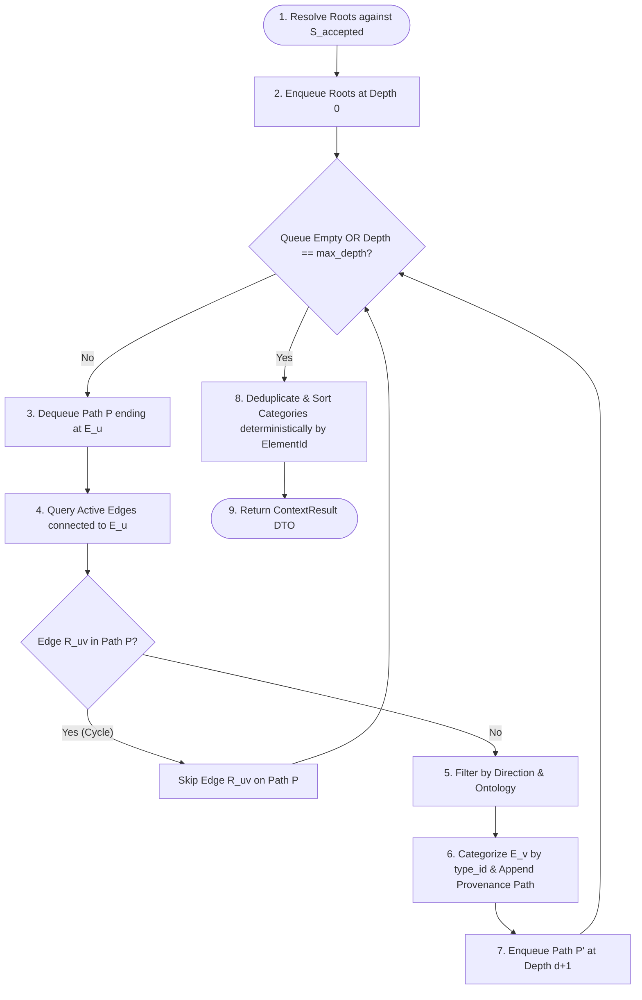

# KAT v0.4 Context Model

## Status

Draft.

This document defines the semantic projection, traversal algorithm, and result structure for the `Context` operation in KAT v0.4.

It is derived from:

- the v0.4 foundation documents ([`findings.md`](file:///home/joshua/Projects/kat/docs/implementation/v0.4/findings.md), [`requirements.md`](file:///home/joshua/Projects/kat/docs/implementation/v0.4/requirements.md), [`use-cases.md`](file:///home/joshua/Projects/kat/docs/implementation/v0.4/use-cases.md), [`operations.md`](file:///home/joshua/Projects/kat/docs/implementation/v0.4/operations.md), [`reference-model.md`](file:///home/joshua/Projects/kat/docs/implementation/v0.4/reference-model.md));
- the interaction model ([`interaction-model.md`](file:///home/joshua/Projects/kat/docs/implementation/v0.4/interaction-model.md));
- the authoring infrastructure model ([`authoring-model.md`](file:///home/joshua/Projects/kat/docs/implementation/v0.4/authoring-model.md)).

The central thesis of this document is:

> **`Context` is a deterministic, bounded, explainable projection of the semantic graph optimized for orientation and development routing.**

It avoids two non-functional extremes:
1. $\text{Context} \neq \text{graph dump}$ (it is not an unrestricted or exhaustive raw graph dump).
2. $\text{Context} \neq \text{AI-selected "relevant files"}$ (it performs zero probabilistic inference or LLM guessing).

---

# 1. Purpose & User Intention

`Context` is the primary retrieval porcelain capability for KAT v0.4.

It satisfies the developer intention:

> *"What is the semantic context, rationale, and physical code structure surrounding this feature or requirement?"*

In v0.1 through v0.3.1, answering this question required manually orchestrating a sequence of independent primitive queries:

```text
kat show <id>
kat trace <id>
kat impact <id>
kat artifacts
kat validate
```

`Context` composes these underlying traversal primitives into a single deterministic semantic projection.

---

# 2. Composition Architecture

`Context` composes rationale, consequences, evidence, responsibilities, and physical anchors into a structured neighborhood around one or more root entry points:

```text
                                ROOT ENTRY POINT(S)
                                         │
       ┌─────────────────┬───────────────┼───────────────┬─────────────────┐
       ▼                 ▼               ▼               ▼                 ▼
   PROVENANCE      REQUIREMENTS     CONSTRAINTS      DECISIONS      IMPLEMENTATIONS
  (Intent / Rationale)                                                   │
       │                                                                 │
       ▼                                                                 ▼
   VALIDATIONS                                                       ARTIFACTS
   (Evidence)                                                     (Physical Anchors)
```

---

# 3. Deterministic Category Membership Rule

Category membership in `ContextResult` is a **deterministic projection of active Knowledge Element types**, while relationship predicates explain **why a node was reached (path provenance)**.

## Category Mapping

```text
kat.core/intent          ──>  provenance
kat.core/requirement     ──>  requirements
kat.core/constraint      ──>  constraints
kat.core/design-decision ──>  decisions
kat.core/implementation  ──>  implementations
kat.core/artifact        ──>  artifacts
kat.core/validation      ──>  validations
```

A node's category is determined strictly by its element type, regardless of the relationship predicate used to reach it:

- If a `Design Decision` is reached via an incoming `addresses` edge from a `Requirement`, the node belongs to `decisions` (its element type), while the path provenance records `addresses`.
- If a `Requirement` is reached via a `motivates` edge from an `Intent`, the node belongs to `requirements` (its element type), while the path provenance records `motivates`.

## Root Categorization Rule

A root entry point:
1. Always appears in the `roots` section of `ContextResult`.
2. **Also** appears in its corresponding semantic-type category (`requirements`, `decisions`, etc.).

This ensures `roots` identifies retrieval entry points while semantic categories remain complete projections of element types in the retrieved neighborhood.

---

# 4. State Isolation & Input Rules

## Accepted-State Isolation

`Context` is strictly read-only. It operates exclusively over point-in-time accepted state $S_{\text{accepted}}$.

It does **not** evaluate against open draft candidate working state $S_{\text{working}}$. Candidate draft inspection remains strictly inside `kat change status` and the draft workflow.

## Accepted Input References

Input root references for `Context` must resolve to accepted repository state:

```text
roots: full UUID or unambiguous UUID prefix (>= 8 hex digits)
```

Draft-local workflow references (e.g. `@temp-handle`) are **invalid** inputs for normal accepted `Context` queries.

---

# 5. Traversal Algorithm & Cycle Prevention

`Context` executes a deterministic breadth-first graph traversal over accepted repository state $S_{\text{accepted}}$.

## 5.1 Traversal Inputs

Conceptually:

```text
ContextInputs {
    roots: Vec<ElementIdReference>,
    max_depth: Option<usize>,
    categories: Option<HashSet<String>>,
    direction: TraversalDirection,
}
```

- **`roots`**: One or more accepted element references (UUID or hex prefix).
- **`max_depth`**: Maximum relationship hops from any root (v0.4 initial default: `2` hops, to be validated empirically during evaluation).
- **`categories`**: Optional category filter (e.g. restrict retrieval to `requirements` and `artifacts`).
- **`direction`**: Traversal direction (`Both` [default], `Upstream` [rationale], `Downstream` [consequences]).

## 5.2 Path-Local Cycle Prevention & Node Deduplication

`Context` reuses KAT's established cycle-prevention semantics:

1. **Path-Local Cycle Prevention**: For each active traversal path $P$, an active `RelationshipId` may appear **at most once** in $P$. This permits multiple distinct paths to reach the same element:
   ```text
   Root
    ├─ R1 -> A -> R3 -> X
    └─ R2 -> B -> R4 -> X
   ```
   while preventing infinite loop traversal on cyclic relationship graphs ($A \xrightarrow{R_1} B \xrightarrow{R_2} A \dots$).
2. **Result Node Deduplication**: Nodes within each result category (`requirements`, `decisions`, etc.) are deduplicated by stable `ElementId`. Multiple paths reaching the same node are preserved inside the node's `provenance_paths` list.

## 5.3 Execution Steps

1. **Root Resolution**: Resolve all supplied root references against accepted state $S_{\text{accepted}}$. If any root reference is unknown or ambiguous, return `ResolveError` immediately (all-or-nothing root resolution).
2. **Queue Initialization**: Initialize FIFO queue with `(root_id, depth = 0, path_edges = [])`.
3. **BFS Expansion**:
   For each path $P$ ending at element $E_u$ at depth $d < \text{max\_depth}$:
   - Query active relationship versions in $S_{\text{accepted}}$ connected to $E_u$.
   - Filter edges by `direction` and allowed ontology predicates.
   - For each edge $R_{uv}$ connecting to adjacent element $E_v$:
     - Check path-local cycle rule: If $R_{uv} \in P.\text{path\_edges}$, skip expansion on this path.
     - Append $E_v$ to the candidate result set.
     - Categorize $E_v$ according to its canonical `type_id` (`kat.core/requirement` $\to$ `requirements`, etc.).
     - Record path hop $(E_u \xrightarrow{R_{uv}} E_v)$ in $E_v$'s provenance path record.
     - If $d + 1 < \text{max\_depth}$, enqueue new path $P' = P \cup \{R_{uv}\}$ at depth $d + 1$.
4. **Multi-Root Deduplication & Sorting**: Deduplicate result nodes within each category by stable `ElementId`. Sort nodes deterministically by `ElementId`.
5. **Truncation Indicator**: If any edge expansion was skipped because depth reached `max_depth`, set `is_truncated = true` on the result.



---

# 6. Artifact Anchors & Physical Routing

`Context` treats `kat.core/artifact` elements as **semantic routing anchors** into physical code, NOT as an exhaustive AST file dependency graph.

## Physical Locator Abstraction

`ContextResult` exposes an abstract `physical_locator` string for Artifact nodes, extracted from element title or property data (e.g. `path` property or title string if formatted as a path):

```text
Artifact Element
    ├── element_id: 9cec3c64-...
    ├── title: "src/store.js - persistence code"
    ├── properties:
    │     path = "src/store.js"
    └── represents:
          Implementation "JSON-file store" (99822b8d-...)
```

`ContextResult` maps this to `physical_locator: Some("src/store.js")`.

## Routing Principle

KAT provides semantic routing to Artifact anchor files; ordinary language servers, file tools, and IDEs perform fine-grained physical code navigation.

---

# 7. Abstract Context DTO

```text
ContextResult {
    max_depth_applied: usize,
    is_truncated: bool,
    roots: Vec<ElementSummary>,
    provenance: Vec<ContextNode>,
    requirements: Vec<ContextNode>,
    constraints: Vec<ContextNode>,
    decisions: Vec<ContextNode>,
    implementations: Vec<ContextNode>,
    artifacts: Vec<ArtifactAnchorNode>,
    validations: Vec<ContextNode>,
}

ContextNode {
    element_id: ElementId,
    type_id: String,
    title: Option<String>,
    provenance_paths: Vec<ProvenancePath>,
}

ArtifactAnchorNode {
    element_id: ElementId,
    title: Option<String>,
    physical_locator: Option<String>,
    accountability_status: AccountabilityStatus, // CURRENT | STALE | UNACCOUNTED
    represented_implementation_ids: Vec<ElementId>,
    provenance_paths: Vec<ProvenancePath>,
}

ProvenancePath {
    root_element_id: ElementId,
    hops: Vec<PathHop>,
}

PathHop {
    relationship_id: RelationshipId,
    relationship_type: String,
    target_element_id: ElementId,
}
```

Concrete machine DTO serialization is defined in [`machine-interface.md`](file:///home/joshua/Projects/kat/docs/implementation/v0.4/machine-interface.md).

---

# 8. Invariants & Guarantees

## INV-CTX-01: Accepted-State Isolation

`Context` is strictly read-only. It operates exclusively over point-in-time accepted state $S_{\text{accepted}}$. It never mutates object storage or accepted state.

## INV-CTX-02: Deterministic Semantic Result Equivalence

Given the same accepted state $S_{\text{accepted}}$, active `OntologyVersion`, input roots, and traversal bounds:

$$\text{Context execution} \implies \text{identical ordered } \text{ContextResult} \text{ semantics}$$

Concrete byte formatting is defined separately by presentation and machine serialization specifications.

## INV-CTX-03: Zero Probabilistic Inference

`Context` returns only elements and relationships that explicitly exist in accepted repository state. It performs zero LLM guessing or heuristic link creation.

## INV-CTX-04: Explicit Truncation Signal

If graph expansion is stopped because depth reached `max_depth`, `is_truncated` is set to `true` in `ContextResult`.

---

# 9. Next Specification Stage

The next document in the specification sequence is:

```text
docs/implementation/v0.4/graph-quality-model.md
```

It shall define:
- advisory graph quality diagnostic rules (`GraphQuality`);
- diagnostic classes (`IsolatedElement`, `RequirementWithoutRealizationPath`, `ImplementationWithoutArtifactRoute`, `DesignDecisionWithoutConsequencePath`);
- integration into the porcelain `check` health operation.
