# KAT v0.4 Implementation Plan

## Status

Draft.

This document defines the dependency-ordered execution roadmap, Rust module architecture, testing plan, and verification milestones for implementing KAT v0.4.

It is derived from the frozen v0.4 specification suite:

- Foundation Documents ([`findings.md`](file:///home/joshua/Projects/kat/docs/implementation/v0.4/findings.md), [`requirements.md`](file:///home/joshua/Projects/kat/docs/implementation/v0.4/requirements.md), [`use-cases.md`](file:///home/joshua/Projects/kat/docs/implementation/v0.4/use-cases.md), [`operations.md`](file:///home/joshua/Projects/kat/docs/implementation/v0.4/operations.md), [`reference-model.md`](file:///home/joshua/Projects/kat/docs/implementation/v0.4/reference-model.md));
- Infrastructure & Interaction Specifications ([`authoring-model.md`](file:///home/joshua/Projects/kat/docs/implementation/v0.4/authoring-model.md), [`interaction-model.md`](file:///home/joshua/Projects/kat/docs/implementation/v0.4/interaction-model.md));
- Detailed Design Specifications ([`context-model.md`](file:///home/joshua/Projects/kat/docs/implementation/v0.4/context-model.md), [`graph-quality-model.md`](file:///home/joshua/Projects/kat/docs/implementation/v0.4/graph-quality-model.md), [`machine-interface.md`](file:///home/joshua/Projects/kat/docs/implementation/v0.4/machine-interface.md), [`cli.md`](file:///home/joshua/Projects/kat/docs/implementation/v0.4/cli.md)).

---

# 1. Implementation Architecture & Module Layout

The implementation adds new modules under `src/` while strictly preserving existing canonical storage and encoding modules:

```text
src/
├── domain/                  (Domain primitives, unchanged canonical objects)
│   ├── identity.rs
│   ├── operation.rs
│   └── machine.rs           [NEW] Envelope DTO types & interface_schema_version
│
├── repository/              (Repository engine & draft session)
│   ├── session.rs           [MODIFY] Add workflow_references map to DraftSession (v2)
│   ├── resolve.rs           [MODIFY] Support draft-local @handle reference resolution
│   ├── change.rs            [MODIFY] Multi-operation atomic batch staging & rollback
│   ├── query.rs             [MODIFY] Add Context query engine & Check aggregator
│   └── validation/
│       └── quality.rs       [NEW] Advisory GraphQuality diagnostic rules (GQ-01..04)
│
├── porcelain/               [NEW] High-level porcelain compiler & workflows
│   ├── mod.rs
│   ├── author.rs            Declarative claim compiler -> canonical mutation ops
│   ├── check.rs             Aggregated health check runner (4 sections)
│   └── context.rs           Context traversal projection builder
│
└── cli/                     (CLI grammar & stream output formatting)
    ├── main.rs              [MODIFY] Wire porcelain commands, aliases & flags
    ├── output.rs            [MODIFY] Enforce stdout/stderr --json process rules
    └── machine_presenter.rs [NEW] Serialize CommonResultEnvelope JSON output
```

---

# 2. Command & Transaction CLI Compatibility Policy

KAT v0.4 preserves 100% backward compatibility for existing CLI commands:

1. **Transaction Subcommands (`kat change ...`)**:
   - `kat change begin`, `kat change status`, `kat change commit`, `kat change abort` remain fully supported as canonical transaction commands.
   - Top-level porcelain commands (`kat status`, `kat commit`, `kat abort`) function as convenient porcelain aliases over the underlying draft transaction engine.
2. **Plumbing Mutation Commands**:
   - All 7 mutation commands (`kat create`, `kat update`, `kat deprecate`, `kat supersede`, `kat link`, `kat unlink`, `kat account`) remain available without modification.

---

# 3. Dependency-Ordered Phased Roadmap

```mermaid
gantt
    title KAT v0.4 Implementation Phases
    dateFormat  X
    axisFormat %s
    
    section Phase 1
    Machine Result Envelope & JSON DTOs    :p1, 0, 1
    section Phase 2
    Workflow References & Draft Session v2 :p2, 1, 2
    section Phase 3
    Atomic Multi-Operation Batch Staging  :p3, 2, 3
    section Phase 4
    Context Retrieval Query Engine         :p4, 3, 4
    section Phase 5
    Graph Quality Rules & Check Porcelain  :p5, 4, 5
    section Phase 6
    Porcelain Declarative Author Compiler  :p6, 5, 6
    section Phase 7
    CLI Stream Rules & Exit Code Wiring    :p7, 6, 7
    section Phase 8
    Regression, Assets & Verification      :p8, 7, 8
```



---

## Phase 1: Machine Result / Envelope Infrastructure & DTOs
- **Goal**: Implement `CommonResultEnvelope<T>` and `ErrorEnvelope` with `interface_schema_version = 1`, nullable repository IDs, explicit `_object_id` field naming, and `INV-MI-01` validation logic.
- **Files**: `src/domain/machine.rs` [NEW], `src/cli/machine_presenter.rs` [NEW].
- **Milestone 1**: Unit tests verify that serialized JSON output conforms to `machine-interface.md` schema, set-like arrays satisfy specified deterministic sorting, and `CommonResultEnvelope` respects `INV-MI-01`.

---

## Phase 2: Workflow Reference & Draft Session Support (DraftSession v2)
- **Goal**: Extend local private draft session storage (`.kat/work/change/session.json`) with `workflow_references` handle bindings. Extend reference resolution in `resolve.rs` to resolve UUIDs, hex prefixes, or `@handle` names.
- **Files**: `src/repository/session.rs` [MODIFY], `src/repository/resolve.rs` [MODIFY].
- **Milestone 2**: Unit tests verify that workflow handles persist across separate process runs in `session.json`, resolve correctly during staging, and disappear upon `commit` or `abort`.

---

## Phase 3: Atomic Multi-Operation Batch Staging & Rollback
- **Goal**: Implement multi-operation batch staging loop with atomic rollback semantics. If operation $j$ of $M$ fails during batch staging, candidate state $S_{\text{working}}$ rolls back in memory to $S_{\text{pre-batch}}$, `session.json` remains untouched on disk, and structured error details are returned.
- **Files**: `src/repository/change.rs` [MODIFY], `src/domain/operation.rs` [MODIFY].
- **Milestone 3**: Integration tests verify that a batch failing at operation $j$ leaves the persisted draft session (`session.json`) byte-for-byte unchanged from its pre-batch representation.

---

## Phase 4: Context Retrieval Query Engine
- **Goal**: Implement `Context` query traversal algorithm over accepted state $S_{\text{accepted}}$, applying path-local `RelationshipId` cycle prevention, type-driven semantic role categorization, deduplication by `ElementId`, and `ArtifactAnchorNode` physical locator extraction.
- **Files**: `src/porcelain/context.rs` [NEW], `src/repository/query.rs` [MODIFY].
- **Milestone 4**: Integration tests verify that `context` executes in a single call over $S_{\text{accepted}}$, respects path-local cycle rules, outputs 8 categorized roles, and sets `is_truncated = true` when `max_depth` limits traversal.

---

## Phase 5: Advisory Graph Quality Diagnostic Rules & Aggregated Check Porcelain
- **Goal**: Implement core quality diagnostic rules `GQ-01` through `GQ-04` in `src/repository/validation/quality.rs`. Construct porcelain `check` aggregator compiling Mechanical Violations (`kat validate`), Evidence Coverage (`kat validate --coverage`), Artifact Accountability (`kat artifacts`), and Advisory Graph Quality (`kat quality`) into `CheckResultDTO`.
- **Files**: `src/repository/validation/quality.rs` [NEW], `src/porcelain/check.rs` [NEW].
- **Milestone 5**: Integration tests verify that `check` outputs a 4-section report, and advisory graph quality findings do not cause non-zero exit codes or block commits.

---

## Phase 6: Porcelain Authoring Compiler (`kat author`)
- **Goal**: Implement declarative claim compiler translating high-level semantic declarations (e.g. Requirement, Implementation, `realizes`) into dependency-valid canonical mutation operations (`CreateElement`, `Link`, etc.) staged via Phase 3.
- **Files**: `src/porcelain/author.rs` [NEW].
- **Milestone 6**: Integration tests verify that declarative authoring input compiles deterministically into staged canonical operations without performing probabilistic inference or guessing.

---

## Phase 7: CLI Porcelain Wiring & Standard Stream / Exit Code Integration
- **Goal**: Wire porcelain commands (`kat status`, `kat context`, `kat author`, `kat check`, `kat commit`, `kat abort`) and transaction aliases in `src/main.rs`. Enforce stdout/stderr `--json` process rules (stdout receives 1 JSON envelope; stderr receives logging/diagnostics) and exit code policies (`kat check --json` returns `success: true` envelope to stdout while exit code is `1` if mechanical violations > 0).
- **Files**: `src/main.rs` [MODIFY], `src/cli/output.rs` [MODIFY].
- **Milestone 7**: CLI integration tests verify stdout/stderr separation and process exit codes for text and machine modes.

---

## Phase 8: Comprehensive Regression, Golden Vectors & Verification Gates
- **Goal**: Run all 445+ existing unit/integration tests, generate man pages and assets (`cargo run --bin generate_assets`), verify zero regression across existing plumbing and transaction commands, and run evaluation scripts.
- **Regression Gates**:
  1. Canonical golden vectors remain byte-identical;
  2. Derived SHA-256 ObjectIds remain byte-identical;
  3. Existing repositories open and validate unchanged;
  4. Accepted-state query isolation is preserved;
  5. Candidate accountability preview invariants are preserved.
- **Files**: `tests/`, `generated/man/kat.1`.
- **Milestone 8**: All unit and integration tests pass cleanly; regression gates pass; man pages updated and committed.

---

# 4. Verification & Testing Strategy

```text
                            TESTING STRATEGY
                                   │
       ┌───────────────────────────┼───────────────────────────┐
       ▼                           ▼                           ▼
  UNIT TESTS              INTEGRATION TESTS           CLI PROCESS TESTS
(DTO schemas, cycle     (Session persistence,      (stdout/stderr separation,
 prevention, DTO sorting)  atomic rollback, context)   exit code 0/1/2 rules)
```

## Automated Test Commands
- `cargo test --all-targets` (Executes unit and integration tests)
- `cargo run --bin generate_assets` (Re-renders man pages and shell completions)
- `git diff --exit-code generated/` (Verifies asset generation freshness)

---

# 5. Success Invariants

1. **Canonical Format Integrity**: 0 changes to CDDL specs, canonical CBOR encodings, or `refs/accepted` storage layout.
2. **Backward Compatibility**: All existing plumbing commands and transaction subcommands (`kat change begin/status/commit/abort`) continue to function identically.
3. **Primitive Exposure Target**: Primitive Exposure $PE \le 0.05$ for standard porcelain workflows.
4. **Machine Interface Invariant**: `INV-MI-01` strictly enforced across all JSON payloads.
