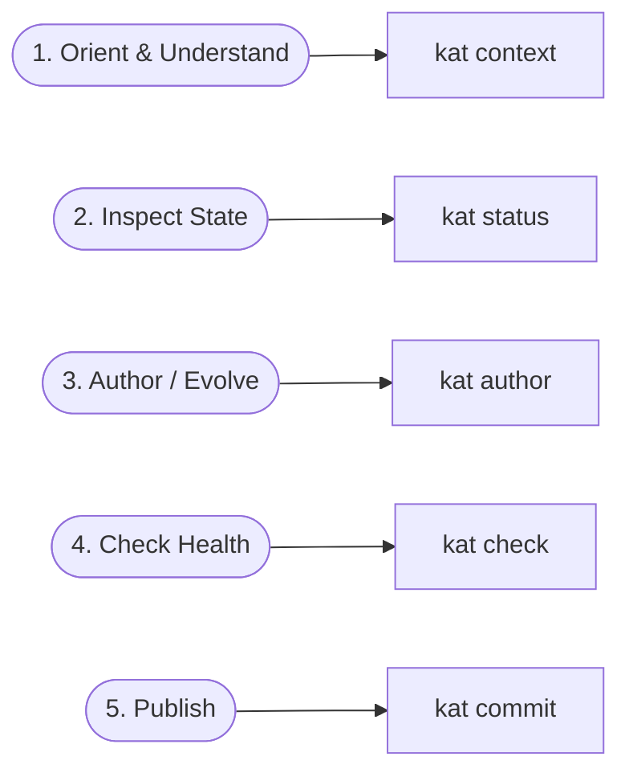

# KAT v0.4 Interaction Model: Porcelain vs. Plumbing

## Status

Draft.

This document defines the high-level user interaction architecture for KAT v0.4.

It is derived from:

- the v0.4 foundation documents ([`findings.md`](file:///home/joshua/Projects/kat/docs/implementation/v0.4/findings.md), [`requirements.md`](file:///home/joshua/Projects/kat/docs/implementation/v0.4/requirements.md), [`use-cases.md`](file:///home/joshua/Projects/kat/docs/implementation/v0.4/use-cases.md), [`operations.md`](file:///home/joshua/Projects/kat/docs/implementation/v0.4/operations.md), [`reference-model.md`](file:///home/joshua/Projects/kat/docs/implementation/v0.4/reference-model.md));
- the authoring infrastructure model ([`authoring-model.md`](file:///home/joshua/Projects/kat/docs/implementation/v0.4/authoring-model.md));
- empirical re-evaluation of the Task Management API, Feature Flag, and Statit experiment command logs.

The central thesis of this document is:

> **KAT does not have too few capabilities. KAT has been exposing its low-level semantic mutation and query primitives directly as standard user workflow.**

This document establishes KAT's three-layer interaction architecture, defines the **Porcelain vs. Plumbing** classification, outlines the 5 core user-intention workflows, and introduces the **Interaction Amplification** metric.

---

# 1. Architectural Re-framing: Porcelain vs. Plumbing

In systems design (such as Version Control Systems like Git), a sharp architectural distinction is drawn between:

- **Plumbing**: Low-level, composable, atomic operations that manipulate data structures deterministically.
- **Porcelain**: High-level, task-oriented commands designed around developer intent.

```text
                    USER INTENTION
                          │
                          ▼
               ┌─────────────────────┐
               │   KAT PORCELAIN     │  (Task-oriented workflows, intent-driven)
               └──────────┬──────────┘
                          │
                          ▼
               ┌─────────────────────┐
               │   KAT OPERATIONS    │  (7 Mutation primitives + 11 Query APIs)
               └──────────┬──────────┘
                          │
                          ▼
               ┌─────────────────────┐
               │     KAT CORE        │  (Canonical objects, SHA-256, refs/accepted)
               └─────────────────────┘
```

## The KAT Problem in v0.1–v0.3.1

In KAT v0.1 through v0.3.1, KAT mapped operations 1-to-1 to CLI commands:

```text
CreateElement   ──>  kat create
Link            ──>  kat link
Unlink          ──>  kat unlink
AccountArtifact ──>  kat account
Show            ──>  kat show
Trace           ──>  kat trace
Impact          ──>  kat impact
```

While clean, this forced developers and agents to act as **manual graph-assembly engines**.

When an agent in the Statit experiment needed to introduce a feature, it had to manually execute **213 mutation commands** (`create` $\times 70$, `link` $\times 110$, `account` $\times 21$, `change begin/commit` $\times 12$). The agent instinctively wrote an external Python orchestration script because KAT lacked a porcelain layer.

---

# 2. Re-evaluating the Empirical Findings

The Porcelain vs. Plumbing distinction reframes the key v0.4 empirical findings:

| Finding | Original Interpretation | Reframed Porcelain Interpretation |
| :--- | :--- | :--- |
| **F-001: Identifier Plumbing** | UUIDs are cumbersome $\to$ add workflow handles | UUID friction was a symptom of forcing users to drive 213 low-level primitive mutations manually. |
| **F-002: External Orchestration** | 213 commands $\to$ add batch input format | The user/agent wanted a porcelain layer (`author`) rather than orchestrating 213 primitive graph mutations. |
| **F-003: Fragmented Retrieval** | 29 queries $\to$ add `Context` query | Commands were organized around data-model operations (`show`, `trace`, `impact`) rather than developer questions. |
| **F-005: Graph Quality** | Mechanical validity $\neq$ graph quality | Users shouldn't need to learn whether to run `validate`, `validate --coverage`, `status`, or `quality`; a porcelain `check` command reports complete repository health. |

---

# 3. Core Design Principle: Simplify Orchestration, Not Meaning

A critical guardrail governs KAT's porcelain layer:

> **Simplify orchestration, not meaning.**

KAT's porcelain layer shall **never** use probabilistic inference, LLM guessing, or silent heuristics to invent relationships or element types.

Meaning remains explicitly declared by the user or agent. The porcelain layer automates the lower-level orchestration (translating high-level intent declarations into ordered canonical mutation operations, handle assignments, and candidate state transitions).

---

# 4. Interaction Amplification Metric

We define **Interaction Amplification** ($IA$) as:

$$IA = \frac{\text{Count of Primitive KAT Operations Executed}}{\text{Count of Distinct User Intentions}}$$

- **v0.1–v0.3.1 Baseline**: $IA = \frac{213 \text{ primitive operations}}{6 \text{ user intentions}} \approx \mathbf{35.5}$ operations per intent.
- **v0.4 Porcelain Target**: $IA \to \mathbf{1.0}$ operation per intent for standard workflows.

The porcelain layer collapses $IA$ by accepting task-oriented declarations and generating the underlying canonical operations (`CreateElement`, `Link`, `AccountArtifact`, etc.) inside the draft session automatically.

---

# 5. Classification of KAT Commands

KAT v0.4 formally categorizes all capabilities into three interaction tiers:

```text
┌────────────────────────────────────────────────────────────────────────┐
│ 1. PORCELAIN (Everyday Task Workflows)                                 │
│    status        Inspect draft & accepted repository status             │
│    context       Retrieve bounded semantic development context          │
│    author        Express high-level semantic changes (declarative)      │
│    check         Report comprehensive repository health                 │
│    commit        Publish open candidate transaction                     │
├────────────────────────────────────────────────────────────────────────┤
│ 2. ADVANCED INSPECTION (Targeted Diagnostics & Analysis)               │
│    show          Inspect single element details & direct edges          │
│    trace         Examine origin rationale graph                         │
│    impact        Analyze downstream semantic consequences               │
│    artifacts     Inspect artifact accountability baselines              │
│    ontology      Discover active schema types and rules                 │
│    history       Examine revision history                               │
├────────────────────────────────────────────────────────────────────────┤
│ 3. PLUMBING / PRIMITIVES (Direct Canonical Graph Mutations)            │
│    create        Create single KnowledgeElementVersion                  │
│    update        Update single KnowledgeElementVersion                  │
│    deprecate     Deprecate single element                               │
│    supersede     Supersede design decision                              │
│    link          Create single RelationshipVersion                      │
│    unlink        Remove single relationship                             │
│    account       Re-baseline single artifact                            │
└────────────────────────────────────────────────────────────────────────┘
```

---

# 6. The 5 Core User Intentions & Porcelain Workflows

KAT v0.4 organizes standard developer interaction around **5 core intentions**:



## Intention 1: Orient & Understand (`kat context`)
- **Developer Question**: *"What is the semantic context, rationale, and physical code structure surrounding this feature or requirement?"*
- **Porcelain Action**: Executes bounded neighborhood retrieval, grouping results into `provenance`, `requirements`, `constraints`, `decisions`, `implementations`, `artifacts`, and `validations`.
- **Replaces**: Repeated manual invocation sequences of `show`, `trace`, `impact`, `artifacts`, and file searches.

## Intention 2: Inspect State (`kat status`)
- **Developer Question**: *"Where am I? Is a draft open, and what changes are staged?"*
- **Porcelain Action**: Displays accepted head status, active draft presence, staged operations, declared workflow handles, candidate delta, candidate accountability preview, and candidate validation.

## Intention 3: Author / Evolve (`kat author`)
- **Developer Question**: *"I want to declare the requirements, decisions, implementations, and artifact mappings for a feature."*
- **Porcelain Action**: Accepts task-oriented declarative input (single block or file), auto-assigns workflow reference handles, orders operations, executes candidate transitions against $S_{\text{working}}$, and stages canonical mutation operations inside `.kat/work/change/session.json`.

## Intention 4: Check Health (`kat check`)
- **Developer Question**: *"Is the semantic repository healthy, conformant, covered, and aligned?"*
- **Porcelain Action**: Runs a single comprehensive health check exposing 4 distinct diagnostic sections:
  1. Mechanical Consistency Violations (from `validate`).
  2. Evidence Coverage (from `validate --coverage`).
  3. Artifact Accountability (from `artifacts --stale`).
  4. Graph Quality Diagnostics (from `quality`).

## Intention 5: Publish (`kat commit`)
- **Developer Question**: *"Publish my verified candidate Change transaction to accepted state."*
- **Porcelain Action**: Validates candidate $S_{\text{working}}$, resolves workflow handles to stable UUIDs, encodes canonical `ChangeRevision`, updates `refs/accepted`, and cleans up `.kat/work/change/session.json`.

---

# 7. Structural Composition: How Porcelain Drives Plumbing

The porcelain layer operates directly on top of the lower-level authoring infrastructure defined in [`authoring-model.md`](file:///home/joshua/Projects/kat/docs/implementation/v0.4/authoring-model.md):

```text
User Intent Input (Declarative Subsystem Block)
                       │
                       ▼
          Porcelain Compiler / Translator
                       │
                       ├─► Declares WorkflowReferences (@req, @impl, @art)
                       ├─► Generates ordered Canonical Operations:
                       │     1. CreateElement(Requirement)
                       │     2. CreateElement(Implementation)
                       │     3. CreateElement(Artifact)
                       │     4. Link(@impl realizes @req)
                       │     5. Link(@art represents @impl)
                       │
                       ▼
          Authoring Infrastructure (authoring-model.md)
                       │
                       ├─► Validates preconditions against S_(k-1)
                       ├─► Advances candidate state S_0 ──> S_working
                       └─► Persists to .kat/work/change/session.json
```

This ensures complete backward compatibility: primitive commands (`kat create`, `kat link`) remain available for precision scripting or low-level tool access, while porcelain commands (`kat author`, `kat check`, `kat context`) provide high-density interaction for humans and AI agents.

---

# 8. Machine Interaction in the Porcelain Model

For Machine Clients and AI Agents:

1. **Porcelain Machine Output**: Porcelain commands (`context`, `status`, `check`, `author`, `commit`) support `--json` structured output, allowing agents to execute 1 porcelain call to retrieve complete context or perform a multi-element evolution.
2. **Plumbing Access**: Plumbing commands continue to accept and return exact canonical UUIDs for deterministic low-level manipulation when needed.

---

# 9. Next Specification Stage

With the interaction architecture established, the detailed design sequence proceeds as:

```text
FOUNDATION [Frozen]
    findings.md
    requirements.md
    use-cases.md
    operations.md
    reference-model.md

INFRASTRUCTURE & INTERACTION [Frozen / Active]
    authoring-model.md       (Authoring infrastructure & session.json mechanics)
    interaction-model.md     (Porcelain vs Plumbing & 5 Core User Intentions)  <- [COMPLETED]

DETAILED DESIGN SPECS
    context-model.md         (Bounded neighborhood retrieval specification)  <- [NEXT]
    graph-quality-model.md   (Advisory quality diagnostic rules)
    machine-interface.md     (JSON schemas for porcelain & plumbing DTOs)
    cli.md                   (Concrete CLI grammar, flags, & porcelain options)

EXECUTION
    implementation-plan.md
    evaluation-plan.md
```

The immediate next document is:

```text
docs/implementation/v0.4/context-model.md
```

It will define the detailed graph traversal algorithms, root provenance tracking, category grouping, and truncation bounds for the primary retrieval porcelain command: `kat context`.
